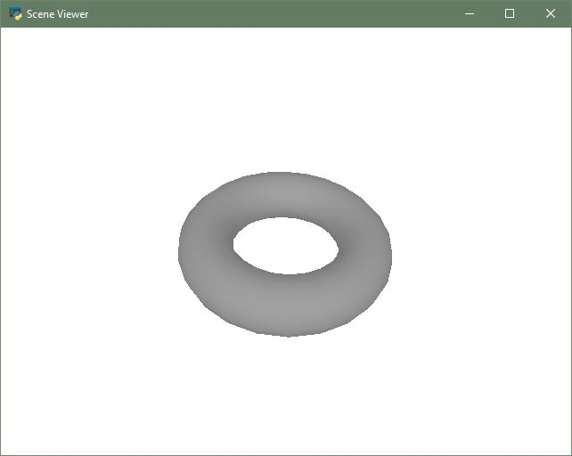
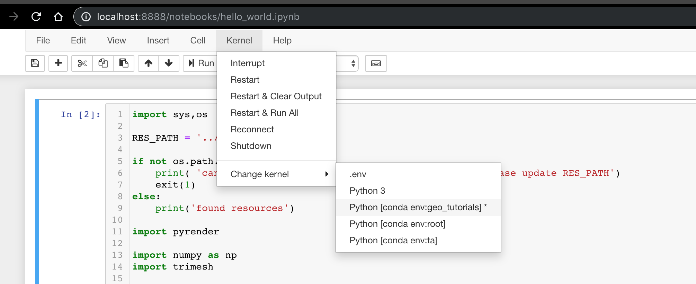

# Python - Coding Framework

## Installation   
If you already use conda, you can skip steps 1 and 2.
1. Download and install [anaconda/miniconda with python 3](https://docs.anaconda.com/miniconda/install/).
Or on mac, just do
`curl -O https://repo.anaconda.com/miniconda/Miniconda3-latest-MacOSX-arm64.sh
		sh Miniconda3-latest-MacOSX-arm64.sh`.
2. Follow the instructions on the above link to 'verify your install' to check that it has worked.

Trouble shooting:
    + Choose the correct version for your operating system.
    + If you are asked “Do you wish the installer to initialize Anaconda3 by running conda init?”, say yes.
    + Read the installation FAQ: [Anaconda FAQ]( https://docs.anaconda.com/anaconda/user-guide/faq/#installing-anaconda ) (you might need to manually add anaconda to the path with `source path-to-conda/bin/activate` and `conda init`)
    + If you're using Linux/OSX, check whether this solves your issue: [stackexchange Add to PATH]( https://askubuntu.com/questions/760311/anaconda-i-have-to-type-export-path-anaconda3-bin-path-everytime-i-rerun )


3. cd to this repository `lab_demos/coding_framework/python`
4. Create a new virtual environment geo_tutorials, using the command   
````conda create -n  geo_tutorials  python=3.9  pip  notebook  jupyter  matplotlib````

5. Activate the new environment
`conda activate geo_tutorials`  
reference:
    ````
    (base) >conda create -n  geo_tutorials  python=3.9  pip  notebook  jupyter  matplotlib
    Collecting package metadata (current_repodata.json): done
    Solving environment: done
    
    ## Package Plan ##
    
      environment location: /home/luca/miniconda3/envs/geo_tutorials
    
      added / updated specs:
        - jupyter
        - matplotlib
        - notebook
        - pip
        - python=3.9

    ....

    Proceed ([y]/n)? y

    Preparing transaction: done
    Verifying transaction: done
    Executing transaction: done
    #
    # To activate this environment, use
    #
    #     $ conda activate geo_tutorials
    #
    # To deactivate an active environment, use
    #
    #     $ conda deactivate 
    (base) >conda activate geo_tutorials 
    (geo_tutorials) > 
    ````
    You should keep the conda environment activated when you run the following installation commands.
    
6. Install mamba on top of conda for faster packages installation (Optional)

    Follow the instructions on mamba [doc page](https://mamba.readthedocs.io/en/latest/installation.html).

    `conda install mamba -n base -c conda-forge`

7. Verify python and pip (Linux/OSX)
    ````
    (base) $ which python3
    /home/xxx/miniconda3/envs/geo_tutorials/bin/python3
    (base) $ which pip
    /home/xxx/miniconda3/envs/geo_tutorials/bin/pip
    ```` 

## Install Trimesh 

1. Install trimesh
   `mamba install -c conda-forge trimesh`
   or
   `conda install -c conda-forge trimesh`
2. open python in this environment and check that you can run `import trimesh` without errors


## Install numpy and scipy
1. `conda install -n geo_tutorials numpy scipy`

## Install Pyrender

1. Install pyglet via `conda install -n geo_tutorials -c conda-forge pyglet`
(This pre-installs pyrender's fork of pyglet, which enables OpenGL contexts - might only be necessary on mac)

2. Install pyrender via `conda install -n geo_tutorials -c conda-forge pyrender`
3. Check that you can run `import pyrender` in python.

Trouble shooting:
- You could try installing pyglet via github instead of conda:
    ```
    git clone https://github.com/mmatl/pyglet.git
    cd pyglet
    pip install .
   ```
- You could try installing pyrender via pip instead of conda:
   `pip install pyrender==0.1.45` 
   

2. Launch a hello world example    
    `python hello_world_pyrender.py `  
    
    
* document: 
[pyrender install document](https://pyrender.readthedocs.io/en/latest/install/index.html)  


## Install Open3D 

1. Install open3d via  
    `conda install -c conda-forge open3d`
2. Check that you can import open3d in python:
    `import open3d`
    
If 1 or 2 causes errors, try installing via
    `pip install open3d` or `pip install open3d-cpu`.

3. Launch the hello world example    
    `python hello_world_o3d.py`
    It should open a window showing a torus that you can drag around using your mouse.
    If you press `w`, it should show a wireframe view.
    
* documentation:  
[open3d documentation](http://www.open3d.org/docs/release/introduction.html)  


## Install libigl

1. `python -m pip install libigl`

Alternatives if pip doesn't work:
    1. `mamba install -c conda-forge igl`
    2. `mamba install -c conda-forge meshplot` to visualize with libigl

* documentation is [here](https://libigl.github.io/libigl-python-bindings/igl_docs/)

**Note:** the docs can be hard to parse

## Check halfedge mesh library

1. In a notebook, `from ..... import halfedge`


    
## Launch jupyter notebook
1. cd `lab_demos/coding_framework/python`  
2. `jupyter notebook`
    This should open a browser window where you can open files.
3. open [helloworld_o3d.ipynb](helloworld_o3d.ipynb) or [helloworld_pyrender.ipynb](helloworld_pyrender.ipynb) (in 

4. If you encountered pyglet exceptions, it may due to jupyter notebook is not running in `geo_tutorials` environment.  
     If this happens, please install the following packages:
     ```
     conda deactivate
     mamba install nb_conda_kernels
     mamba install -n geo_tutorials ipykernels
     conda activate geo_tutorials`
     jupyter notebook --port 12000 --NotebookApp.token=''
     ```
     open `helloworld_pyrender.ipynb`

     switch environment  
     


